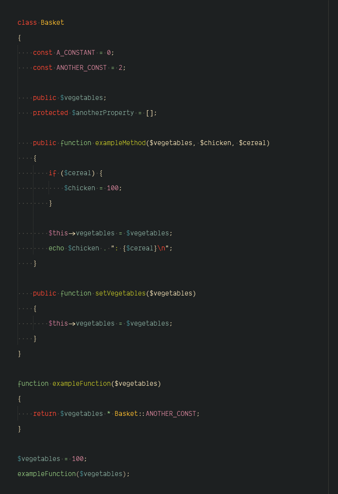

#### Semantic Highlighter

🌈 Highlights similar variables on focus

It underlines variables with the same string (for now).
Sublime does this by double-clicking a word but why do two if you can do one!

> *oooh but that is not "semantic"..* - a wise man

Sure. Here are suggestions for you though.

- Use a different [package](https://github.com/vprimachenko/Sublime-Colorcoder)
- Modify your color scheme file using Sublime's "[Hashed Syntax Highlighting](https://www.sublimetext.com/docs/3/color_schemes.html#hashed_syntax_highlighting)"
- use VS Code

##### Installation

- Install from `packagecontrol.io` or unpack the [zip](https://github.com/kapitanluffy/sublime-semantic-highlighter/archive/master.zip) in your packages directory

##### Usage

1. Move your cursor to a variable using the following:

    - Mouse 🖱
    - Arrow keys ⌨

2. See colored underlines.

##### Features

- See beautiful colors 🌈
- Lessens stress (especially when accompanied with ☕)
- Improve understanding of your co-worker's gibberish code 😒
- Easily see where that variable has been hiding 👀

#### Commands

- `semantic_highlighter_jump` (`ctrl+l`, `ctrl+j`)
Jump to the next variable in scope

- `semantic_highlighter_edit` (`ctrl+l`, `ctrl+e`)
Edit all the similar variables in scope

##### The color-scheme file

The package comes with a customizable template color scheme that has 144 varying HSL representations.
For now, I simply fetch a random number and match it.

##### Creating a custom analyzer

The plugin will highlight symbols based on an analyzer. Since I cannot do every programming language,
you can further improve *variable detection* by creating your own language analyzer.

For a quick intro, the *analyzer* class has a `getBlockScope` method that should return one of the following:

- A scope name string of the block the symbol belongs to
- `None` if the selection is a valid symbol but does not belong to any blocks (i.e. global variable)
- `False` if the selection is not a valid symbol

To understand how "scopes" work, check out the following links:

- [Scope Naming](https://www.sublimetext.com/docs/3/scope_naming.html).
- [Selectors](https://www.sublimetext.com/docs/3/selectors.html)

##### Included analyzers

- A generic *fallback* analyzer
- Python
- PHP

##### Support

You can always support me via [Patreon](https://www.patreon.com/kapitanluffy)

##### License

[MIT](LICENSE)

##### Links
- ~~Inspired~~ Frustrated by [Sublime Color-coder](https://github.com/vprimachenko/Sublime-Colorcoder)
- Read about [Semantic Highlighting](https://zwabel.wordpress.com/2009/01/08/c-ide-evolution-from-syntax-highlighting-to-semantic-highlighting/)
